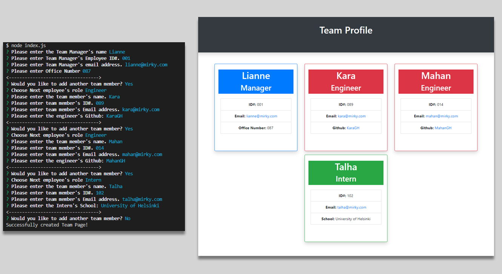

#  Module 10 : Team Profile Generator

## Overview

I have created a Team page HTML generator that uses the command-line application to create an HTML page populated with colour coded cards built with information provided on the CLI.

## Installation

NodeJS and a command line application will be needed to use the product.

## Usage

The application is run by runnning <node index.js> in the CLI when in the appropriate directory.
Once started, the user will be prompted for information regarding each team member starting with the manager.
As many team members can be added as needed.

The final output is the team.html file in the same directory.

### Links

 [Github Repo](https://github.com/sashdc/readme-generator)
 
 [Walkthrough Video](https://drive.google.com/file/d/13uRr5rhECB3i4q0DHX2-naE-lwqJImal/view)

 ## Credits

Cherian, Saharsh

[Creator Github](https://github.com/sashdc)

## License

N/A